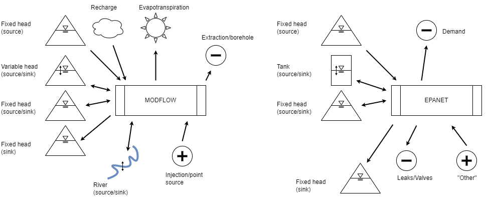
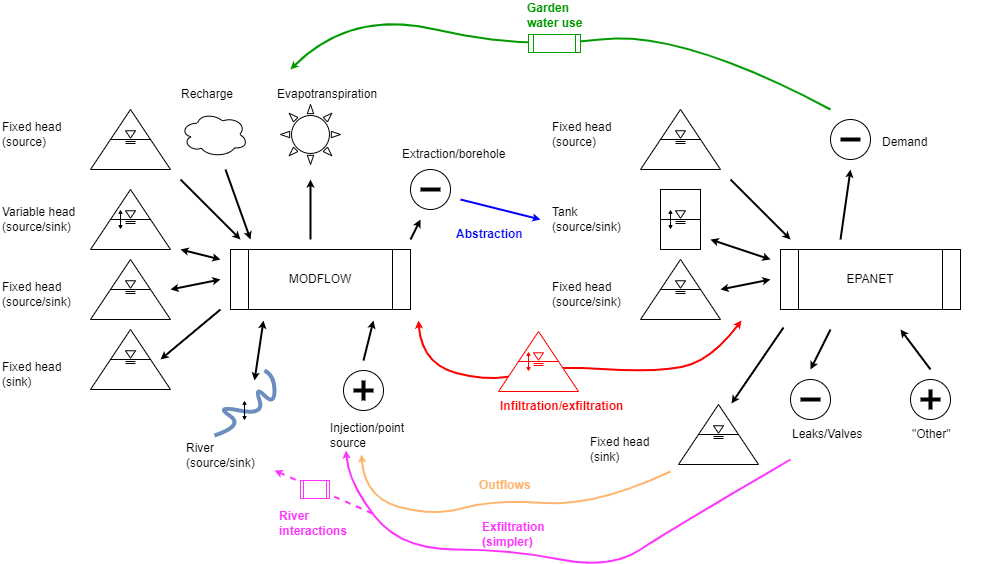
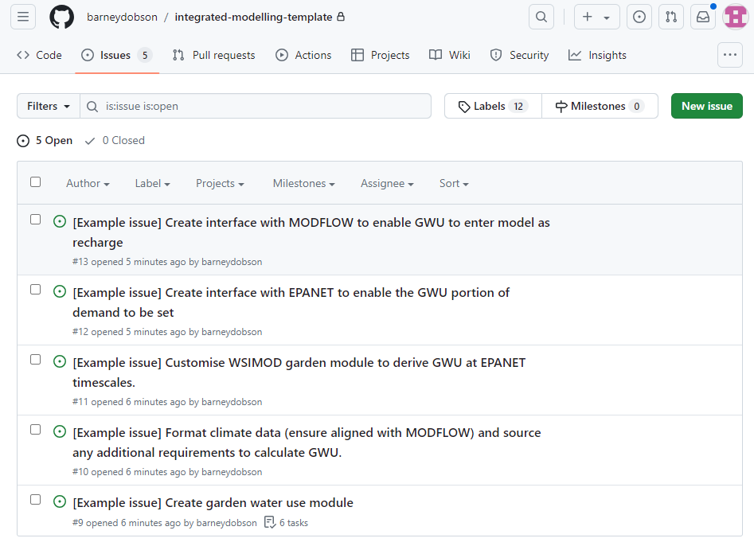
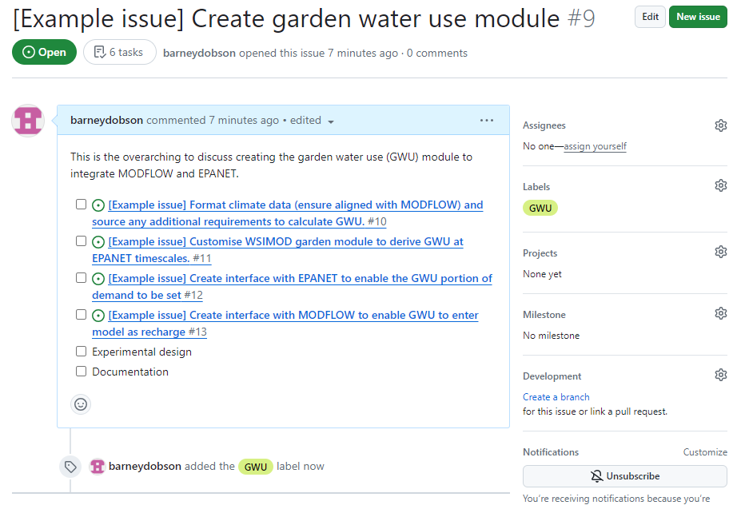
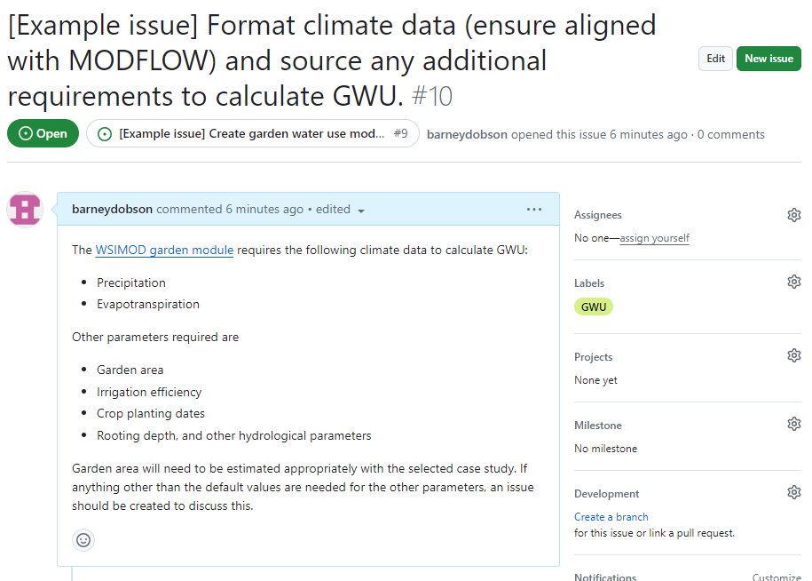

# Integrated modelling workshop

The overview of our integration day

- 09:00-09:10 Explain the day (now)
- 09:10-09:40 Present overviews:
  - [Inputs/outputs](#water-in-water-out)
  - [Conceptual diagram](#conceptual-diagram)
- 09:40-13:30 (30 min coffee break, 1 hour lunch break): [Fill in integration templates](#20-minute-integration-template)

## Example: groundwater (MODFLOW) and supply distribution (EPANET)

I don't know either of these models well, I just asked ChatGPT for info in the
inputs/outputs. These examples will be used throughout this explanation

## Introduction

Explain your system, I will present groundwater and supply distribution side-by
-side.

### Water in-water out

Where does water/pollutants come in/go out?

<!-- markdownlint-disable MD033 -->
<table>
   <!--- Headers -->
   <tr><th></th><th>MODFLOW</th><th>EPANET</th>

   <!--- Row 1, input section -->
   <tr>
      <td rowspan="4">Inputs</td>
      <td>Recharge from surface (includes precipitation, irrigation, or other surface water bodies).</td>
      <td>Reservoirs, with a fixed head thus representing a large store.</td>
   </tr>

   <!--- Row 2 -->
   <tr>
      <td>Rivers and streams (boundary condition model).</td>
      <td>Tanks, sources or sinks with variable elevation and head.</td>
   </tr>

   <tr>
      <td>Generalised/fixed head boundaries (reservoirs, lakes, lateral aquifer flows?)</td>
      <td>Other external inflows.</td>
   </tr>

   <tr>
      <td>Point and distributed pollutant sources/Injection wells.</td>
      <td></td>
   </tr>

   <!---Output section -->
   <tr>
      <td rowspan="4">Outputs</td>
      <td>Generalised/fixed head boundaries.</td>
      <td>Nodes representing demand.</td>
   </tr>

   <tr>
      <td>Rivers and streams (boundary condition model).</td>
      <td>Tanks, sources or sinks with variable elevation and head.</td>
   </tr>

   <tr>
      <td>Evapotranspiration.</td>
      <td>Reservoirs, with a fixed head thus representing a large store.</td>
   </tr>

   <tr>
      <td>Extraction wells.</td>
      <td>Leaks and valves.</td>
   </tr>

</table>

### Conceptual diagram

Other information is fine, but make sure to highlight all of your inputs and
outputs, in particular dynamic ones!

_Made with [draw.io](https://app.diagrams.net/?src=about#)_

## 20-minute integration template

You can find a fillable version [here](https://forms.gle/QNAvMLefKcAe4EoBA).

- [What models/systems do you care about?](#models)
- [Do any inputs/outputs directly match?](#direct-integration)
- [Do any inputs/outputs indirectly match?](#indirect-integration)
- [Update conceptual diagram](#conceptual-diagram-integrated)
- [Explore feasibility](#explore-feasibility)

### Models

- Groundwater: MODFLOW
- Supply distribution: EPANET

### Direct integration

- Leaks/Valves -> MODFLOW? I guess leak could be a point water/pollutant source,
 or maybe aggregate into recharge from surface.
- If there is a groundwater supply borehole, then that could be pumped from
MODFLOW enter the EPANET tanks?
- EPANET reservoirs seem like the system outflow - perhaps some of this can go
into MODFLOW depending on the case study.

### Indirect integration

- Generalised head boundaries in MODFLOW - maybe these could match with network
head in distribution? Presumably enabling infiltration (in the unpressurised
sections) or exfiltration (anywhere).
- Leaks/valves -> MODFLOW via river interactions (depends where the leaks go..).
- Garden water use interacting with recharge/evapotranspiration (probably needs
a model to 'translate' the EPANET demand outputs).

### Conceptual diagram integrated

Make sure to highlight all of your inputs, outputs and integration links!

### Explore feasibility

1. **Are these identified integrations likely to induce boundary condition errors
in one system or the other! (i.e., why integrate)**
2. What temporal scale mismatches exist?
3. What spatial scale mismatches exist?
4. How complicated are the processes in between [indirect integration](#indirect-integration)?
5. What kind of case studies might these work for?

For example:

1. Would the integration tell us anything important?

   - Anecdotal evidence that leakage plays a significant groundwater source in urban
areas (i.e., importance of exfiltration), though this is probably more useful for
leakage estimation because groundwater will not be that sensitive to the day-to-day
dynamics of leakage.
   - Suppose distribution networks are nearly
always pressurised (i.e., unimportance of infiltration).
   - Garden water use can be
seasonally a very significant portion of water supply, though unsure if this is
over timescales that would impact groundwater (i.e., unknown importance of garden
water use).
   - Although boreholes do provide supply, I would expect that daily variations
that EPANET captures are unlikely to significantly impact groundwater (i.e., expected
unusefulness of abstraction), same is probably true for outflows/leaks.

2. Temporal scale mismatch:

   - EPANET typically run at 1-15 minute resolution.
   - MODFLOW at daily or monthly, or possibly hourly on small scales.
   - The resolutions aren't aligned, but not insurmountable. The more important
   question is whether there will be any interesting questions that can be
   answered if the dynamics that EPANET provides are mostly smoothed out.

3. Spatial scale mismatch:

   - Both models accommodate wide variety of scales.
   - Key spatial challenge is mapping pipes to MODFLOW grid.

4. Indirect processes:

   - The infiltration/exfiltration "adaptor" doesn't sound overwhelmingly
   complicated to me, accommodating the scale mismatches sounds hardest part.
   Validating it may be difficult because of lack of data.
   - Garden water use is a reasonably well-studied field, don't anticipate
   significant difficulties.

5. Case studies:

   - Whether integration is interesting seems to rely heavily on the temporal scales
   being sufficiently near that the dynamics may interact. Presumably the most
   promising case studies would thus have quick to respond groundwater (gravels,
   etc.) and also be on relatively small scales (e.g., distribution network
   causing localised basement flooding).
   - Highly urbanised areas seems to be a given considering the EPANET focus.
   - Leaks->rivers, outfalls->groundwater, or groundwater->infiltration seem to
   be unlikely for the most part, but there may be specific case studies where
   this behaviour occurs.

## What next?

1. Identify a research question(s) - why integrate?
2. Formalise your integrated conceptual model, using it as a map to build around:

   - Include the internal model processes as well as interactions.
   - Identify if you have any relevant case studies, even if they only cover
   part of the integrated conceptual model.
   - Consider scale mismatches in more detail, map where this mismatches occur
   and what can be done to fix them.
   - How do the model software work? Which bits can be interfaced with and which
   will require something custom? Is new code required, where?

3. Make a plan:

   - Who is in charge?
   - What are the key tasks and how long might they take?
   - Who can do what?
   - What's missing?

### Turn your plan into GitHub issues

If you want to use this page to take your project further then please use
the [GitHub template](docs/template.md).

You can use the GitHub [issues] as a to do list. With an added bonus that your `git`
setup will already be in place when it comes to software development.

It is sensible to organise issues with ["big-picture"] issues and checklists.

And then use separate issues when you are ready to get [specific].

