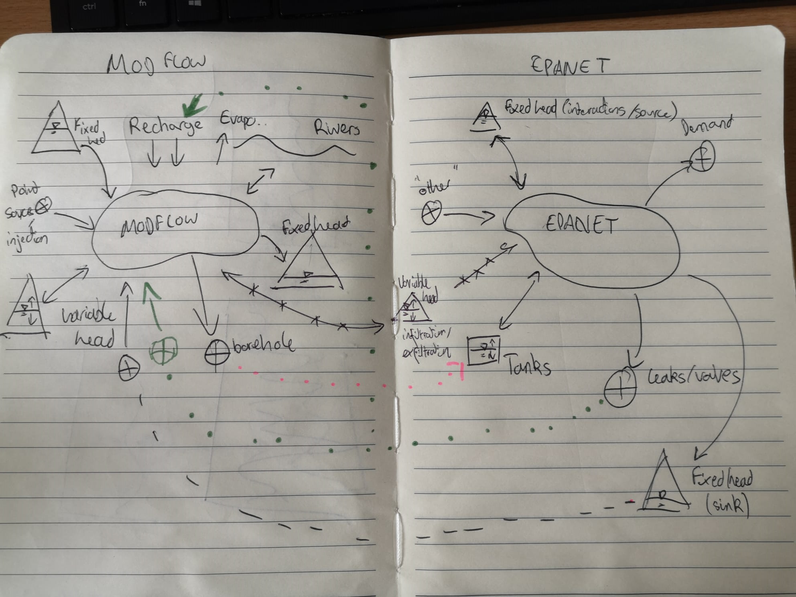

# Integrated modelling workshop

If you want to use this GitHub page to take your project further then please use
the [template](docs/template.md).

## 20-minute integration template

- [What models/systems do you care about?](#models)
- [Where does water/pollutants come in from?](#waterpollutant-inputsoutputs)
- [Where does water/pollutants go out to?](#waterpollutant-inputsoutputs)
- [Do any inputs/outputs match?](#direct-integration)
- [What additional processes need to be represents in between the outputs/inputs
of the models?](#indirect-integration)
- [Sketch a conceptual outline](#conceptual-diagram)

## Example: groundwater and supply distribution

I don't know about either of these models, I just asked ChatGPT for info. It
took 5 minutes to fill in the table, 5 minutes to think about interactions, and
10 minutes to sketch the integrated conceptualisation.

### Models

- Groundwater: MODFLOW
- Supply distribution: EPANET

### Water/pollutant inputs/outputs

<!-- markdownlint-disable MD033 -->
<table>
   <!--- Headers -->
   <tr><th></th><th>MODFLOW</th><th>EPANET</th>

   <!--- Row 1, input section -->
   <tr>
      <td rowspan="4">Inputs</td>
      <td>Recharge from surface (includes precipitation, irrigation, or other surface water bodies).</td>
      <td>Reservoirs, with a fixed head thus representing a large store.</td>
   </tr>

   <!--- Row 2 -->
   <tr>
      <td>Rivers and streams (boundary condition model).</td>
      <td>Tanks, sources or sinks with variable elevation and head.</td>
   </tr>

   <tr>
      <td>Generalised/fixed head boundaries (reservoirs, lakes, lateral aquifer flows?)</td>
      <td>Other external inflows.</td>
   </tr>

   <tr>
      <td>Point and distributed pollutant sources/Injection wells.</td>
      <td></td>
   </tr>

   <!---Output section -->
   <tr>
      <td rowspan="4">Outputs</td>
      <td>Generalised/fixed head boundaries.</td>
      <td>Nodes representing demand.</td>
   </tr>

   <tr>
      <td>Rivers and streams (boundary condition model).</td>
      <td>Tanks, sources or sinks with variable elevation and head.</td>
   </tr>

   <tr>
      <td>Evapotranspiration.</td>
      <td>Reservoirs, with a fixed head thus representing a large store.</td>
   </tr>

   <tr>
      <td>Extraction wells.</td>
      <td>Leaks and valves.</td>
   </tr>

</table>

### Direct integration

- Leaks/Valves -> MODFLOW? I guess leak could be a point water/pollutant source,
 or maybe aggregate into recharge from surface.

### Indirect integration

- Generalised head boundaries in MODFLOW - maybe these could match with network
head in distribution? Presumably enabling infiltration (in the unpressurised
sections) or exfiltration (anywhere).
- EPANET reservoirs seem like the infinite sink - perhaps some of this can go
into MODFLOW depending on the case study.
- If there is a groundwater supply borehole, then that could be pumped from
MODFLOW and, with some encouragement be related to the EPANET tanks?

### Conceptual diagram

Make sure to highlight all of your inputs, outputs and integration links!

## Take your integration further

- How complicated are the processes in between [indirect integration](#indirect-integration)?
- What temporal scale mismatches exist?
- What spatial scale mismatches exist?
- What other missing data is there?
